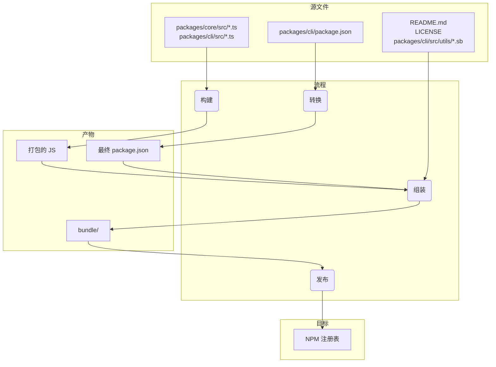

# 包概述

这个 monorepo 包含两个主要包：`@google/gemini-cli` 和 `@google/gemini-cli-core`。

## `@google/gemini-cli`

这是 Gemini CLI 的主包。它负责用户界面、命令解析和所有其他面向用户的功能。

当这个包发布时，它会被打包成一个单独的可执行文件。这个包包含了所有包的依赖项，包括 `@google/gemini-cli-core`。这意味着无论用户是通过 `npm install -g @google/gemini-cli` 安装包，还是直接通过 `npx @google/gemini-cli` 运行，他们都在使用这个单一的、自包含的可执行文件。

## `@google/gemini-cli-core`

这个包包含与 Gemini API 交互的核心逻辑。它负责发出 API 请求、处理身份验证和管理本地缓存。

这个包不会被打包。当它发布时，它作为一个标准的 Node.js 包发布，带有自己的依赖项。这允许它在需要时作为独立包在其他项目中使用。`dist` 文件夹中的所有转译 js 代码都包含在包中。

# 发布流程

这个项目遵循结构化的发布流程，以确保所有包都被正确版本化和发布。该流程设计得尽可能自动化。

## 如何发布

发布通过 [release.yml](https://github.com/google-gemini/gemini-cli/actions/workflows/release.yml) GitHub Actions 工作流管理。要执行补丁或热修复的手动发布：

1. 导航到仓库的 **Actions** 选项卡。
2. 从列表中选择 **Release** 工作流。
3. 点击 **Run workflow** 下拉按钮。
4. 填写必需的输入：
   - **Version**：要发布的确切版本（例如，`v0.2.1`）。
   - **Ref**：要发布的分支或提交 SHA（默认为 `main`）。
   - **Dry Run**：保持为 `true` 以测试工作流而不发布，或设置为 `false` 执行实际发布。
5. 点击 **Run workflow**。

## 夜间发布

除了手动发布，这个项目还有自动化的夜间发布流程，为测试和开发提供最新的"前沿"版本。

### 流程

每晚 UTC 午夜时分，[Release 工作流](https://github.com/google-gemini/gemini-cli/actions/workflows/release.yml) 会按计划自动运行。它执行以下步骤：

1. 从 `main` 分支检出最新代码。
2. 安装所有依赖项。
3. 运行完整的 `preflight` 检查和集成测试套件。
4. 如果所有测试成功，它会计算下一个夜间版本号（例如，`v0.2.1-nightly.20230101`）。
5. 然后构建并发布包到 npm，使用 `nightly` 分发标签。
6. 最后，为夜间版本创建 GitHub Release。

### 失败处理

如果夜间工作流中的任何步骤失败，它会自动在仓库中创建一个新的 issue，标签为 `bug` 和 `nightly-failure`。该 issue 将包含失败工作流运行的链接，便于调试。

### 如何使用夜间构建

要安装最新的夜间构建，使用 `@nightly` 标签：

```bash
npm install -g @google/gemini-cli@nightly
```

我们还运行一个名为 [release-docker.yml](../.gcp/release-docker.yaml) 的 Google cloud build。它发布沙盒 docker 以匹配您的发布。一旦服务账户权限问题解决，这也将移至 GH 并与主发布文件合并。

### 发布后

工作流成功完成后，您可以在 [GitHub Actions 选项卡](https://github.com/google-gemini/gemini-cli/actions/workflows/release.yml) 中监控其进度。完成后，您应该：

1. 转到仓库的 [pull requests 页面](https://github.com/google-gemini/gemini-cli/pulls)。
2. 从 `release/vX.Y.Z` 分支到 `main` 创建一个新的 pull request。
3. 审查 pull request（它应该只包含 `package.json` 文件中的版本更新）并合并它。这保持 `main` 中的版本是最新的。

## 发布验证

推送新发布后，应该执行冒烟测试以确保包按预期工作。这可以通过本地安装包并运行一组测试来确保它们正常运行。

- `npx -y @google/gemini-cli@latest --version` 验证推送是否按预期工作（如果您没有使用 rc 或 dev 标签）
- `npx -y @google/gemini-cli@<release tag> --version` 验证标签是否正确推送
- _这在本地是破坏性的_ `npm uninstall @google/gemini-cli && npm uninstall -g @google/gemini-cli && npm cache clean --force && npm install @google/gemini-cli@<version>`
- 建议进行基本的冒烟测试，运行几个 llm 命令和工具，以确保包按预期工作。我们将来会更多地编码化这个过程。

## 何时合并版本更改，或不合并？

上述从当前或较旧提交创建补丁或热修复发布的模式使仓库处于以下状态：

1. **标签** (`vX.Y.Z-patch.1`)：此标签正确指向 main 上包含您打算发布的稳定代码的原始提交。这很关键。任何检出此标签的人都会获得已发布的确切代码。
2. **分支** (`release-vX.Y.Z-patch.1`)：此分支在标记的提交之上包含一个新提交。该新提交仅包含 package.json 中的版本号更改（以及其他相关文件如 package-lock.json）。

这种分离是好的。它保持您的主分支历史记录清洁，不包含特定于发布的版本提升，直到您决定合并它们。

这是关键决策，完全取决于发布的性质。

### 为稳定补丁和热修复合并回去

对于任何稳定的补丁或热修复发布，您几乎总是希望将 `release-<tag>` 分支合并回 `main`。

- 为什么？主要原因是更新 main 的 package.json 中的版本。如果您从较旧的提交发布 v1.2.1 但从不合并版本提升，您的 main 分支的 package.json 仍将显示 "version": "1.2.0"。下一个开始为下一个功能发布（v1.3.0）工作的开发人员将从具有不正确、较旧版本号的代码库分支。这会导致混乱，并需要稍后手动版本提升。
- 流程：在创建 release-v1.2.1 分支并成功发布包后，您应该打开一个 pull request 将 release-v1.2.1 合并到 main。此 PR 将只包含一个提交："chore: bump version to v1.2.1"。这是一个干净、简单的集成，保持您的主分支与最新发布版本同步。

### 不要为预发布（RC、Beta、Dev）合并回去

您通常不会将预发布的发布分支合并回 `main`。

- 为什么？预发布版本（例如，v1.3.0-rc.1、v1.3.0-rc.2）根据定义是不稳定的和临时的。您不希望用一系列发布候选版本的版本提升来污染主分支的历史记录。main 中的 package.json 应该反映最新的稳定发布版本，而不是 RC。
- 流程：创建 release-v1.3.0-rc.1 分支，执行 npm publish --tag rc，然后...分支已经完成了它的目的。您可以简单地删除它。RC 的代码已经在 main（或功能分支）上，所以没有功能代码丢失。发布分支只是版本号的临时载体。

## 本地测试和验证：打包和发布流程的更改

如果您需要测试发布流程而不实际发布到 NPM 或创建公共 GitHub 发布，您可以从 GitHub UI 手动触发工作流。

1. 转到仓库的 [Actions 选项卡](https://github.com/google-gemini/gemini-cli/actions/workflows/release.yml)。
2. 点击 "Run workflow" 下拉菜单。
3. 保持 `dry_run` 选项选中（`true`）。
4. 点击 "Run workflow" 按钮。

这将运行整个发布流程，但会跳过 `npm publish` 和 `gh release create` 步骤。您可以检查工作流日志以确保一切按预期工作。

在提交对打包和发布流程的任何更改之前，在本地测试这些更改是至关重要的。这确保包将被正确发布，并且在用户安装时按预期工作。

要验证您的更改，您可以执行发布流程的试运行。这将模拟发布流程而不实际将包发布到 npm 注册表。

```bash
npm_package_version=9.9.9 SANDBOX_IMAGE_REGISTRY="registry" SANDBOX_IMAGE_NAME="thename" npm run publish:npm --dry-run
```

此命令将执行以下操作：

1. 构建所有包。
2. 运行所有预发布脚本。
3. 创建将发布到 npm 的包 tarball。
4. 打印将发布的包的摘要。

然后您可以检查生成的 tarball 以确保它们包含正确的文件，并且 `package.json` 文件已正确更新。tarball 将在每个包目录的根目录中创建（例如，`packages/cli/google-gemini-cli-0.1.6.tgz`）。

通过执行试运行，您可以确信您对打包流程的更改是正确的，包将成功发布。

## 发布深入解析

发布流程的主要目标是从 packages/ 目录获取源代码，构建它，并在项目根目录的临时 `bundle` 目录中组装一个干净、自包含的包。这个 `bundle` 目录是实际发布到 NPM 的内容。

以下是关键阶段：

阶段 1：发布前健全性检查和版本控制

- 发生什么：在移动任何文件之前，流程确保项目处于良好状态。这涉及运行测试、linting 和类型检查（npm run preflight）。根 package.json 和 packages/cli/package.json 中的版本号更新为新的发布版本。
- 为什么：这保证只有高质量、可工作的代码被发布。版本控制是表示新发布的第一步。

阶段 2：构建源代码

- 发生什么：packages/core/src 和 packages/cli/src 中的 TypeScript 源代码被编译为 JavaScript。
- 文件移动：
  - packages/core/src/\*_/_.ts -> 编译为 -> packages/core/dist/
  - packages/cli/src/\*_/_.ts -> 编译为 -> packages/cli/dist/
- 为什么：开发期间编写的 TypeScript 代码需要转换为可以由 Node.js 运行的纯 JavaScript。核心包首先构建，因为 cli 包依赖于它。

阶段 3：组装最终可发布包

这是最关键的阶段，文件被移动和转换为发布的最终状态。在项目根目录创建一个临时的 `bundle` 文件夹来容纳最终的包内容。

1. `package.json` 被转换：
   - 发生什么：从 packages/cli/ 读取 package.json，修改并写入根 `bundle`/ 目录。
   - 文件移动：packages/cli/package.json -> （内存转换）-> `bundle`/package.json
   - 为什么：最终的 package.json 必须与开发中使用的不同。关键更改包括：
     - 删除 devDependencies。
     - 删除工作区特定的 "dependencies": { "@gemini-cli/core": "workspace:\*" } 并确保核心代码直接打包到最终的 JavaScript 文件中。
     - 确保 bin、main 和 files 字段指向最终包结构中的正确位置。

2. 创建 JavaScript 包：
   - 发生什么：来自 packages/core/dist 和 packages/cli/dist 的构建 JavaScript 被打包成一个单一的可执行 JavaScript 文件。
   - 文件移动：packages/cli/dist/index.js + packages/core/dist/index.js -> （由 esbuild 打包）-> `bundle`/gemini.js（或类似名称）。
   - 为什么：这创建了一个包含所有必要应用程序代码的单一、优化文件。它通过消除核心包作为 NPM 上单独依赖项的需要来简化包，因为其代码现在直接包含在内。

3. 复制静态和支持文件：
   - 发生什么：不是源代码一部分但包正常工作或良好描述所需的基本文件被复制到 `bundle` 目录。
   - 文件移动：
     - README.md -> `bundle`/README.md
     - LICENSE -> `bundle`/LICENSE
     - packages/cli/src/utils/\*.sb（沙盒配置文件）-> `bundle`/
   - 为什么：
     - README.md 和 LICENSE 是任何 NPM 包都应该包含的标准文件。
     - 沙盒配置文件（.sb 文件）是 CLI 沙盒功能正常运行所需的关键运行时资产。它们必须位于最终可执行文件旁边。

阶段 4：发布到 NPM

- 发生什么：从根 `bundle` 目录内运行 npm publish 命令。
- 为什么：通过从 `bundle` 目录内运行 npm publish，只有我们在阶段 3 中仔细组装的文件被上传到 NPM 注册表。这防止任何源代码、测试文件或开发配置被意外发布，为用户提供干净和最小的包。

文件流摘要



这个流程确保最终发布的产物是项目的专门构建、干净和高效的表示，而不是开发工作区的直接副本。

## NPM 工作区

这个项目使用 [NPM 工作区](https://docs.npmjs.com/cli/v10/using-npm/workspaces) 来管理这个 monorepo 中的包。这通过允许我们从项目根目录管理依赖项并跨多个包运行脚本来简化开发。

### 工作原理

根 `package.json` 文件定义了这个项目的工作区：

```json
{
  "workspaces": ["packages/*"]
}
```

这告诉 NPM `packages` 目录内的任何文件夹都是应该作为工作区一部分管理的单独包。

### 工作区的好处

- **简化依赖管理**：从项目根目录运行 `npm install` 将为工作区中的所有包安装所有依赖项并将它们链接在一起。这意味着您不需要在每个包的目录中运行 `npm install`。
- **自动链接**：工作区内的包可以相互依赖。当您运行 `npm install` 时，NPM 将自动在包之间创建符号链接。这意味着当您对一个包进行更改时，更改立即可用于依赖它的其他包。
- **简化脚本执行**：您可以使用 `--workspace` 标志从项目根目录在任何包中运行脚本。例如，要在 `cli` 包中运行 `build` 脚本，您可以运行 `npm run build --workspace @google/gemini-cli`。